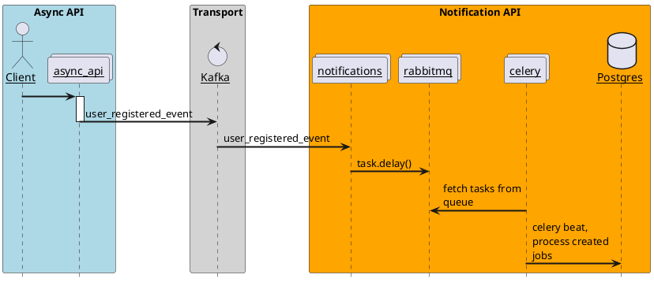

```plantuml
@startuml
skinparam componentStyle uml2
skinparam sequenceArrowThickness 2
skinparam roundcorner 5
skinparam maxmessagesize 120
skinparam sequenceParticipant underline
hide footbox
skinparam BoxPadding 2

box "Async API" #LightBlue
    actor Client
    collections async_api
end box

box "Transport" #LightGray
    control Kafka
end box

box "Notification API" #Orange
    collections notifications
    collections rabbitmq
    collections celery
    database Postgres
end box

Client -> async_api
activate async_api

async_api -> Kafka: user_registered_event
deactivate async_api

Kafka -> notifications: user_registered_event
notifications -> rabbitmq: task.delay()
celery -> rabbitmq: fetch tasks from queue
celery -> Postgres: celery beat, process created jobs
@enduml
```